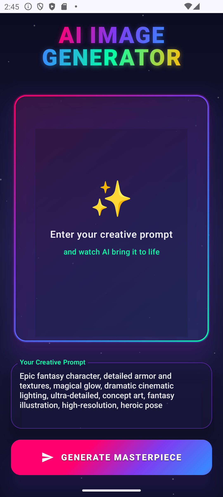
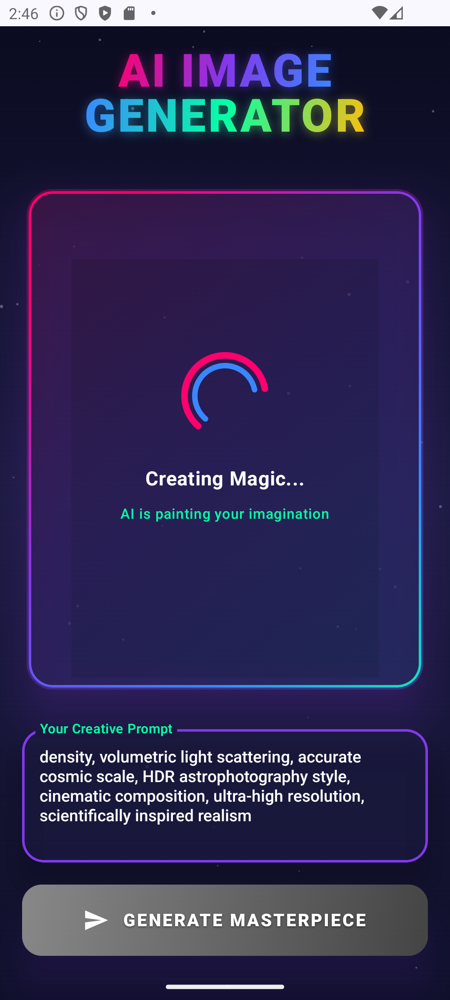
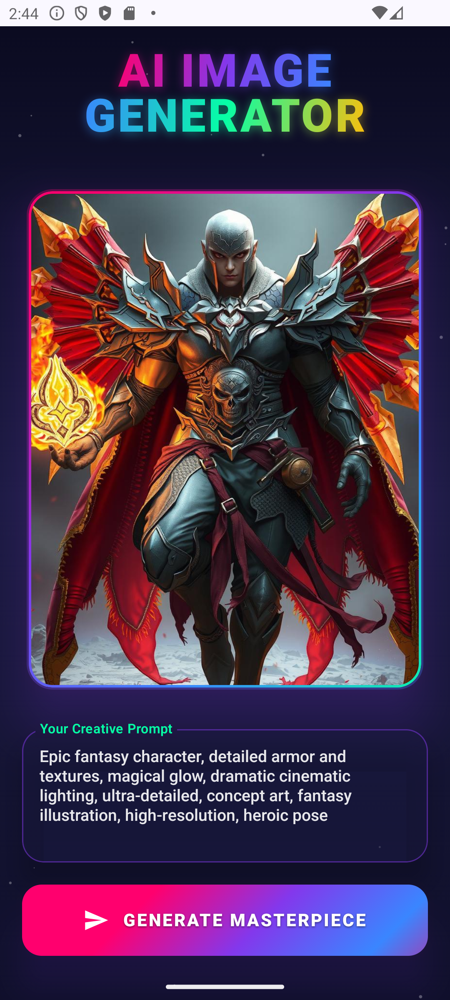
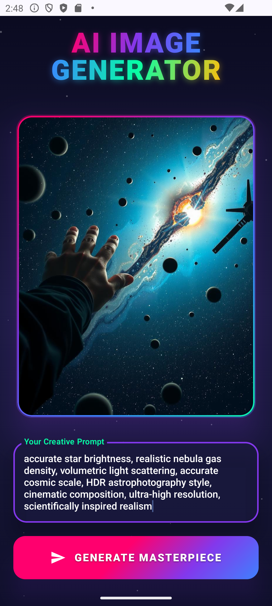

# AI Image Generator - Jetpack Compose + Hugging Face FLUX.1-schnell

  <strong>A beautiful, modern Android app that turns your imagination into stunning AI-generated artwork</strong> 
  Built with Jetpack Compose, Material 3, Kotlin Coroutines, Retrofit, and Hugging Face Inference API (FLUX.1-schnell model)

  
  
  

## ✨ Features

- **Sleek dark cyberpunk-inspired UI** with animated gradients & particles
- Real-time **AI image generation** using Hugging Face Inference API (FLUX.1-schnell)
- Beautiful **shimmer animated generate button**
- Premium-style **loading animation** with dual spinning rings
- Floating particle background animation
- Error handling & empty prompt validation
- Clean MVVM architecture with StateFlow
- Fully responsive & edge-to-edge design

## 📸 Screenshots

 
   
   
   
   

## 🛠️ Tech Stack

- **Language**: Kotlin 
- **UI**: Jetpack Compose + Material 3
- **Architecture**: MVVM + StateFlow
- **Networking**: Retrofit + OkHttp (with logging)
- **Image Loading**: Coil
- **API**: Hugging Face Inference API (FLUX.1-schnell)
- **Coroutines**: For async image generation
- **Animations**: Compose Animation + InfiniteTransition

If you like this project, please ⭐ star the repo — it means a lot!
Happy creating! ✨
